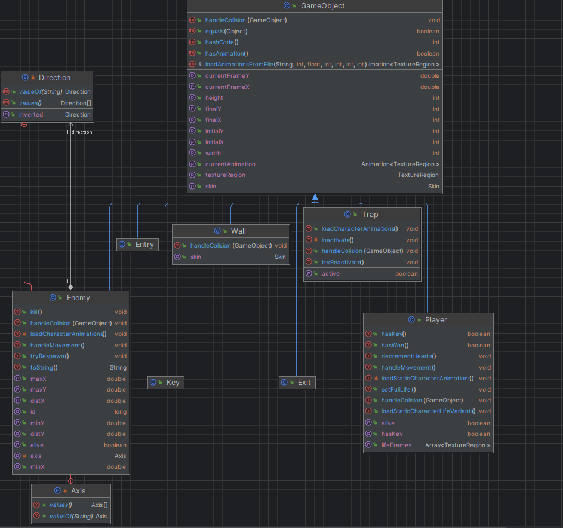
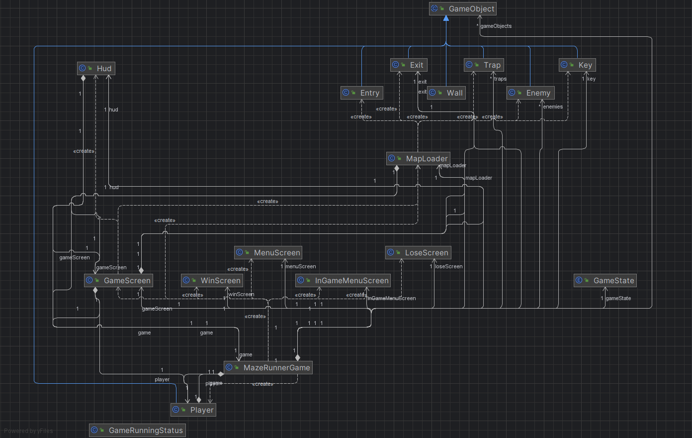

_**MAZE RUNNER GAME PROJECT**_ 

**Project Description** 
This 2D game places the players as a character trying to scape from a maze full of traps and mobs. IN order to do that, he first has to retrieve a key and then find the exit.

**Game instructions** 

1. Firstly the player has to select a map 
2. In order to move the main character, one can simply use the up, down, left and right keys from the keyboard 
3. The objective is to retrieve a key and use it to open the maze's exit 
4. The player has 4 lives 
5. Contact with mobs or traps deducts lives from the player 
6. When colliding with a mob, the same disappears, but respawns again after 4 seconds. This could be used to the players advantage. but keep in mind it will cost you one life.

**Code structure** 

This UML shows how the game elements are structured. The upper class GameObject sets basic attributes and methods shared by all elements. 

The GameScreen Class is responsible for displaying the elements of the game.
The MazeRunnerGame sets game functionalities such as music, menu, gameOver and victory logics. It also initializes the MapLoader class, which generates a new game object according to the map coordinate matrix.

WinScreen, InGameMenuScreen, MenuScreen and LoseScreen are displayed depending on the GameState defined in GameScreen.

**Third-Party interfaces**

1. LibGDX